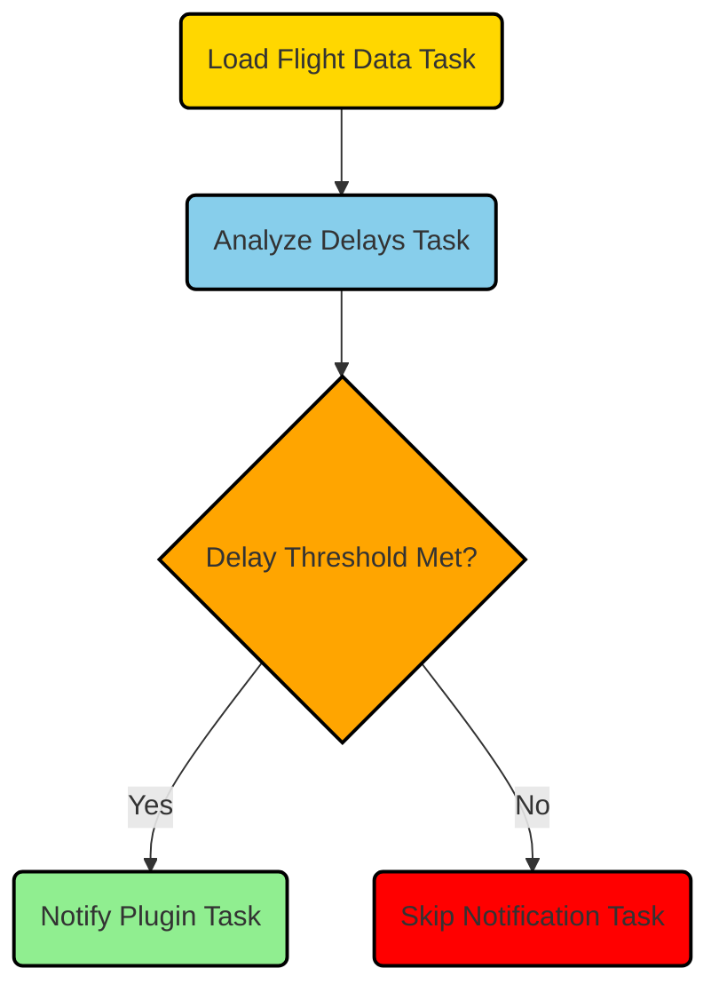

Flight Checker DAG
==================

The Flight Checker DAG is a directed acyclic graph implemented using Airflow. Its purpose is to periodically check for flight delays and perform appropriate actions based on the delay status.

Workflow Overview
-----------------

The workflow consists of three tasks:

1.  `load_flight_data_task`: This task retrieves flight data from an API and stores it in XCom.
2.  `analyze_delays_task`: This task analyzes the flight delays based on the retrieved data and performs necessary actions.
3.  `delayed_api_call_sensor`: This sensor task checks for the condition to make an API call based on the ongoing flight delays.

The workflow is scheduled to run every minute, allowing for near real-time monitoring of flight delays.

FlightChecker Class
-------------------

The `FlightChecker` class encapsulates the logic for loading flight data, analyzing delays, and notifying external services about flight status changes.

### Initialization

The class is initialized with the required environment variables and sets up various configuration parameters. These include:

*   `api_key`: The API key used to access the flights data API.
*   `airports`: The IATA codes of the airports to monitor for flight delays.
*   `airlines`: The airlines to filter the flight data. If set to 'all', no airline filter is applied.
*   `delay_threshold`: The minimum delay duration (in minutes) for a flight to be considered delayed.
*   `time_to_departure_threshold`: The minimum time (in hours) before departure for a flight to be considered for delay analysis.
*   `cancelled_flight_time_window_start` and `cancelled_flight_time_window_end`: The time window (in minutes) after a delay for a cancelled flight to be acknowledged.
*   `api_host` and `api_endpoint`: The URL endpoints for the flights data API.
*   `ignored_destinations_bcn` and `ignored_destinations_ams`: Lists of ignored destinations for Barcelona and Amsterdam airports, respectively.
*   `last_delay_print_time`: A dictionary to keep track of the last delay print time for each airport.

### Environment Variable Validation

The `validate_environment_variables` method ensures that all required environment variables are present and have valid values. If any of the variables are missing or empty, a `ValueError` is raised.

### Loading Flight Data

The `load_flight_data` method retrieves flight data from the API and stores it in XCom. It makes an API request using the configured API key and airport codes. The method handles potential API request failures by retrying with exponential backoff. If the maximum number of retries is exceeded, a `RuntimeError` is raised.

### Analyzing Delays

The `analyze_delays` method analyzes flight delays for each airport based on the retrieved flight data. It filters flights based on the configured airlines and checks for delays that meet the delay threshold and time to departure threshold criteria. The method also handles cancelled flights within a specific time window after a delay is acknowledged. When a delay or cancellation is detected, the method calls the `notify_plugin` method to notify external services (customizable implementation).

### Notifying Plugin

The `notify_plugin` method is a placeholder for notifying a plugin or external service about flight status changes. The method is currently implemented to log the notification details. This implementation can be customized to integrate with specific notification services.

DAG Definition
--------------

The DAG definition follows the Airflow DAG structure.

### Default Arguments

The `default_args` dictionary specifies the default arguments for the DAG. It includes the start date, the number of retries for each task, and the retry delay.

### DAG Initialization

The DAG class is used to define the DAG. The DAG is named "flight\_checker" and has a description. The schedule interval is set to run the DAG every minute. The catchup parameter is set to False to prevent backfilling for missed intervals.

### Task Definition

*   `load_flight_data_task`: This task is defined using the `PythonOperator`. It is associated with the `load_flight_data` method of the `FlightChecker` instance. The `provide_context=True` parameter ensures that the execution context is passed to the method, allowing access to XCom. This task is responsible for loading flight data from the API and storing it in XCom.
    
*   `analyze_delays_task`: This task is defined using the `PythonOperator`. It is associated with the `analyze_delays` method of the `FlightChecker` instance. The `provide_context=True` parameter ensures that the execution context is passed to the method, allowing access to XCom. This task analyzes the flight delays based on the retrieved data and performs appropriate actions.
    
*   `delayed_api_call_sensor`: This sensor task is defined using the `DelayedApiCallSensor` class, which is a custom sensor inheriting from `BaseSensorOperator`. It checks for the condition to make an API call based on the ongoing flight delays. The `poke` method of the sensor is implemented to evaluate the condition.
    

### Task Dependencies

The task dependencies are defined using the `>>` operator. The dependencies are as follows:

1.  `load_flight_data_task` >> `analyze_delays_task`: `analyze_delays_task` depends on the successful completion of `load_flight_data_task`.
2.  `analyze_delays_task` >> `delayed_api_call_sensor`: `delayed_api_call_sensor` depends on the successful completion of `analyze_delays_task`.

This ensures that the tasks are executed in the specified order and that the sensor task waits for the analysis task to finish before evaluating the condition.

Summary
-------

The Flight Checker DAG periodically loads flight data, analyzes delays for specified airports and airlines, and performs actions based on the delay status. It utilizes the `FlightChecker` class to encapsulate the logic and interacts with external services through the `notify_plugin` method. The DAG is designed to run every minute, providing near real-time monitoring of flight delays.
